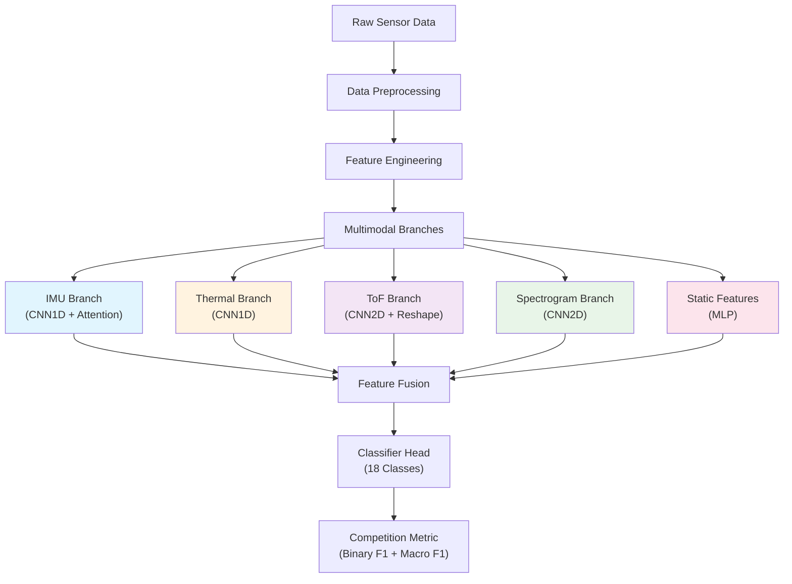
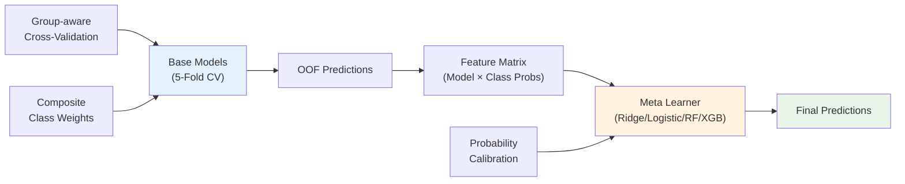

# CMI Gesture Recognition System

A config-driven multimodal deep learning system for detecting body-focused repetitive behaviors (BFRB) using sensor data from IMU, thermal, and time-of-flight sensors.

## System Architecture

### Config-Driven Design

The system uses a centralized configuration approach where all training parameters, model architecture, and data processing settings are defined in Python config files. This ensures reproducibility and easy experimentation.

```
configs/
├── base_config.py          # Base training configuration
├── model_configs/          # Model architecture definitions
│   ├── multimodal_v1.py   # Full multimodal model
│   └── imu_only.py        # IMU-only variant
└── ensemble_configs/       # Stacking configurations
    └── ridge_stack.py     # Ridge meta-learner config
```

### Data Pipeline

The system processes three types of sensor data:
- **IMU**: Linear acceleration + angular velocity (6 channels)
- **Thermal**: Temperature readings from multiple sensors
- **Time-of-Flight**: Distance measurements in 8x8 pixel arrays

### Model Structure

The multimodal architecture processes different sensor types through specialized branches:

#### Architecture Overview



#### Branch Details

- **IMU Branch**: 1D CNN with attention mechanism for temporal acceleration/gyroscope data
- **Thermal Branch**: 1D CNN for temperature sensor readings
- **ToF Branch**: 2D CNN processing 8x8 pixel distance arrays, reshaped for temporal modeling
- **Spectrogram Branch**: 2D CNN analyzing frequency-domain representations of IMU signals
- **Static Features**: MLP for demographic and engineered features

### Ensemble Strategy

The system uses a two-stage stacking approach:



1. **Base Models**: Multiple variants (full/imu) trained with 5-fold group-aware CV
2. **Meta Learner**: Ridge classifier with optional probability calibration
3. **Features**: Concatenated out-of-fold predictions from base models

## Installation

```bash
# Clone repository
git clone <repository-url>
cd cmi_competition

# Install dependencies
pip install torch torchvision torchaudio
pip install scikit-learn pandas numpy polars
pip install lightgbm xgboost catboost  # optional ensemble models
pip install scipy matplotlib seaborn  # for analysis
```

## Usage

### Training Base Models

The training system is fully config-driven. Create or modify config files in `configs/`:

```bash
# Train with specific config
python development/train.py --config configs/multimodal_v1.py

# Show data stratification details
python development/train.py --config configs/multimodal_v1.py --stratification
```

#### Sample Config Structure

```python
# configs/multimodal_v1.py
environment = {
    'seed': 42,
    'gpu_id': None,  # Auto-select
    'num_workers': 8
}

data = {
    'variant': 'full',  # 'full' or 'imu'
    'batch_size': 32,
    'max_length': 100
}

training = {
    'epochs': 50,
    'patience': 15,
    'weight_decay': 1e-2,
    'use_amp': True,
    'mixup_enabled': True,
    'mixup_alpha': 0.4,
    'loss': {'type': 'FocalLoss', 'gamma': 2.0, 'alpha': 1.0},
    'scheduler_cfg': {
        'type': 'cosine',
        'warmup_ratio': 0.1,
        'layer_lrs': {
            'imu': 3e-4,
            'thm': 2e-4,
            'tof': 2e-4,
            'spec': 1e-4,
            'mlp': 1e-3,
            'fusion': 5e-4
        }
    }
}

model = {
    'type': 'MultimodalityModel',
    'imu_branch_cfg': {'hidden_dims': [256, 128]},
    'thm_branch_cfg': {'hidden_dims': [128, 64]},
    'tof_branch_cfg': {'hidden_dims': [256, 128]},
    'spec_branch_cfg': {'hidden_dims': [256, 128]},
    'mlp_branch_cfg': {'hidden_dims': [256, 128]}
}

spec_params = {
    'fs': 50,
    'nperseg': 16,
    'noverlap_ratio': 0.5
}
```

### Ensemble Training (Stacking)

After training base models, use the ensemble module for meta-learning:

```python
# ensemble/stack.py or import ensemble.stack
from ensemble.stack import CONFIG, main

# Configure stacking
CONFIG.update({
    "INPUT_DIR": "./weights",  # Directory with OOF CSV files
    "TRAIN_CSV": "path/to/train.csv",
    "META_MODEL": "ridge",
    "RIDGE_CALIBRATE_PREFIT": True,
    "USE_COMPOSITE_CLASS_WEIGHTS": True
})

# Run stacking
main()
```

Or run directly:
```bash
python -m ensemble.stack
```

### Inference

The inference system supports multiple submission packages with automatic model discovery:

```python
# For Kaggle submission
python cmi-submission/inference.py

# Local testing with verbose output
INFER_VERBOSE=1 python cmi-submission/inference.py
```

## Key Features

### Advanced Training Techniques

- **Discriminative Learning Rates**: Different learning rates per model branch
- **Mixup Augmentation**: Data augmentation for improved generalization  
- **Composite Class Weighting**: Custom BFRB-aware loss weighting
- **Group-aware Cross-Validation**: Subject-based folding to prevent data leakage
- **Mixed Precision Training**: Automatic mixed precision for faster training

### Robust Ensemble Methods

- **Subject-grouped Stacking**: Prevents overfitting in meta-learner
- **Probability Calibration**: Temperature scaling and Platt scaling options
- **Multiple Meta Models**: Ridge, Logistic, Random Forest, XGBoost, LightGBM, CatBoost
- **NaN-safe Pipeline**: Comprehensive handling of missing/invalid values

### Production-ready Inference

- **Multi-package Support**: Handles multiple submission packages automatically
- **Graceful Degradation**: Fallback mechanisms for missing components
- **Memory Optimization**: Efficient resource management for Kaggle constraints
- **Class Name Alignment**: Robust label mapping between training and inference

## File Structure

```
cmi_competition/
├── development/
│   ├── train.py              # Main training script
│   └── configs/              # Training configurations
├── cmi-submission/
│   ├── inference.py          # Kaggle inference script
│   ├── models/               # Model architectures
│   ├── data_utils/           # Data processing utilities
│   └── weights/              # Trained model artifacts
├── ensemble/
│   ├── __init__.py
│   └── stack.py              # Meta-learning/stacking
└── README.md
```

## Competition Metric

The system optimizes for the official competition metric:

**Score = 0.5 × Binary F1 + 0.5 × Macro F1**

Where:
- **Binary F1**: BFRB vs Non-BFRB classification
- **Macro F1**: Average F1 across 9 classes (8 BFRB + 1 combined Non-BFRB)

## Training Workflow

1. **Data Preparation**: Automatic feature engineering and variant detection
2. **Base Model Training**: 5-fold cross-validation with group awareness
3. **OOF Collection**: Out-of-fold predictions saved for stacking
4. **Meta Learning**: Train ensemble on OOF predictions
5. **Artifact Export**: Save models, scalers, and metadata for inference

## Commands Reference

### Training Commands

```bash
# Basic training
python development/train.py --config configs/base_config.py

# With stratification analysis
python development/train.py --config configs/base_config.py --stratification

# Override output directory
TRAIN_OUTPUT_DIR=/custom/path python development/train.py --config configs/base_config.py

# Save results for orchestration
RESULT_JSON_PATH=/path/result.json python development/train.py --config configs/base_config.py
```

### Ensemble Commands

```bash
# Run stacking with default config
python -m ensemble.stack

# Import and configure programmatically
python -c "
from ensemble.stack import CONFIG, main
CONFIG['INPUT_DIR'] = './oof_predictions'
CONFIG['META_MODEL'] = 'ridge'
main()
"
```

### Inference Commands

```bash
# Kaggle submission (production)
python cmi-submission/inference.py

# Local testing with debug output
INFER_VERBOSE=1 INFER_DEBUG=1 python cmi-submission/inference.py

# Enable torch.compile (if stable)
ENABLE_TORCH_COMPILE=1 python cmi-submission/inference.py
```

## Configuration Examples

### Training Configuration

```python
# configs/example_config.py
environment = {
    'seed': 42,
    'gpu_id': 0,
    'num_workers': 8
}

data = {
    'variant': 'full',
    'batch_size': 32,
    'max_length': 100
}

training = {
    'epochs': 50,
    'patience': 15,
    'weight_decay': 1e-2,
    'use_amp': True,
    'mixup_enabled': True,
    'mixup_alpha': 0.4,
    'loss': {
        'type': 'FocalLoss',
        'gamma': 2.0,
        'alpha': 1.0
    },
    'scheduler_cfg': {
        'type': 'cosine',
        'warmup_ratio': 0.1,
        'layer_lrs': {
            'imu': 3e-4,
            'thm': 2e-4,
            'tof': 2e-4,
            'spec': 1e-4,
            'mlp': 1e-3,
            'fusion': 5e-4
        }
    }
}

spec_params = {
    'fs': 50,
    'nperseg': 16,
    'noverlap_ratio': 0.5
}

model = {
    'type': 'MultimodalityModel',
    'imu_branch_cfg': {
        'hidden_dims': [256, 128],
        'use_attention': True
    },
    'thm_branch_cfg': {
        'hidden_dims': [128, 64]
    },
    'tof_branch_cfg': {
        'hidden_dims': [256, 128],
        'reshape_strategy': 'flatten'
    },
    'spec_branch_cfg': {
        'hidden_dims': [256, 128]
    },
    'mlp_branch_cfg': {
        'hidden_dims': [256, 128, 64]
    }
}
```

### Ensemble Configuration

```python
# ensemble/stack.py CONFIG section
CONFIG = {
    "INPUT_DIR": "./weights",
    "TRAIN_CSV": "path/to/train.csv",
    "META_MODEL": "ridge",
    "N_SPLITS": 5,
    "USE_LOGITS": False,
    "SCALE_LINEAR": False,
    "RIDGE_CALIBRATE_PREFIT": True,
    "USE_COMPOSITE_CLASS_WEIGHTS": True,
    "SAVE_DIR": "./stack_artifacts"
}
```

## Output Artifacts

### Training Outputs

- `model_fold_{1-5}_{variant}.pth`: Trained model weights
- `scaler_fold_{1-5}_{variant}.pkl`: Feature scalers
- `spec_stats_fold_{1-5}_{variant}.pkl`: Spectrogram normalization stats
- `spec_params_fold_{1-5}_{variant}.pkl`: Spectrogram generation parameters
- `label_encoder_{variant}.pkl`: Label encoders
- `oof_probas_{variant}.csv`: Out-of-fold predictions
- `kfold_summary_{variant}.json`: Cross-validation summary

### Ensemble Outputs

- `stack_artifacts/{variant}/meta_model.pkl`: Trained meta-learner
- `stack_artifacts/{variant}/meta_info.json`: Meta-model configuration
- `stack_oof.csv`: Second-stage OOF predictions (optional)

## Troubleshooting

### Common Issues

1. **CUDA Out of Memory**
   - Reduce `batch_size` in config
   - Set `use_amp: True` for mixed precision
   - Use `gpu_id: None` for auto-selection

2. **Convergence Issues**
   - Adjust learning rates in `scheduler_cfg.layer_lrs`
   - Increase `patience` for early stopping
   - Check class weights and loss function

3. **Inference Failures**
   - Verify all required artifacts exist in weights directory
   - Check environment variables: `INFER_VERBOSE=1` for debugging
   - Ensure consistent `spec_params` between training and inference

### Performance Optimization

- **Training**: Use `torch.compile`, mixed precision, and optimal batch sizes
- **Inference**: Disable verbose logging, use CPU for meta-learner if memory-constrained
- **Ensemble**: Consider fewer meta-model folds if training time is critical

## License

This project is developed for the CMI competition and follows competition guidelines.

## Authors

- Core architecture and training pipeline
- Ensemble stacking implementation  
- Production inference system
