# CMI Gesture Recognition System

## Competition Result

🥉 **Bronze Medal**: This solution achieved a bronze medal in the CMI - Detect Behavior with Sensor Data competition on Kaggle, placing **187th out of 2657 teams**.

## Authors

-   [@nicksibozhu](https://www.kaggle.com/nicksibozhu)
-   [@co000l](https://www.kaggle.com/co000l)

---

A config-driven, multimodal deep learning system for detecting body-focused repetitive behaviors (BFRB) using sensor data from IMU, thermal, and time-of-flight sensors. This document outlines the core methodologies, system architecture, and usage instructions.

## Core Methodologies

This section details the key strategies that enabled rapid, robust model development.

### 1. Computation — An Efficient Experimental Framework

To enable rapid iteration, we optimized our workflow for speed:

-   **Data Processing Acceleration (pandas → polars)**: We migrated heavy preprocessing from pandas to polars. Its multi-threaded architecture provided a significant performance boost, drastically reducing data preparation time.
-   **Model Training Acceleration (`torch.compile`)**: We used `torch.compile` to JIT-compile the model, which optimized GPU operations and reduced Python overhead for faster training cycles.

These optimizations were a strategic necessity, allowing us to conduct more experiments and thoroughly validate our hypotheses.

### 2. Data — From Raw Signals to Intelligent Features

Our approach to data was two-pronged: sophisticated feature engineering and creating a trustworthy evaluation system.

-   **Feature Engineering**:
    -   **Domain-Knowledge**: We leveraged domain expertise to engineer critical time-domain features (e.g., gravity-compensated linear acceleration, quaternion-derived angular velocity).
    -   **Frequency Domain (Spectrograms)**: We created a spectrogram branch, treating the 1D signal as an "image." This enabled a 2D CNN to explicitly learn from time-frequency representations, capturing features complementary to the 1D branch.
-   **Reliable Cross-Validation (CV)**: We developed a robust CV framework using `StratifiedGroupKFold` for trustworthy evaluation.
    -   **Why Grouped (by `subject`)**: Sequences from the same person are highly correlated. To prevent the model from simply memorizing a person's movement style (data leakage), we group by subject. This ensures that all data from a single subject appears in *either* the training set or the validation set, but never both. This forces the model to generalize to unseen subjects.
    -   **Why Stratified (by `gesture`)**: The gesture classes are imbalanced. Stratification ensures that each fold has the same percentage of samples for each gesture as the entire dataset. This leads to more stable and reliable validation scores across all folds.

### 3. Model — A Narrative of Architectural Evolution

Our model development for time-series classification followed a logical progression, with each architecture addressing the limitations of the last.

-   **Stage 1: The 1D CNN Baseline**: A standard 1D CNN extracted local patterns. However, its reliance on global pooling to compress the temporal dimension resulted in the loss of crucial sequential information.
-   **Stage 2: Introducing Sequential Context with LSTM**: To preserve temporal dependencies, we replaced global pooling with an LSTM. The CNN's output feature map was treated as a sequence, and the LSTM's final hidden state provided a context-aware summary for classification.
-   **Stage 3: Capturing Global Relationships with a Transformer**: To model relationships between all parts of the sequence simultaneously, we used a Transformer. A `[CLS]` token, processed by the self-attention mechanism, created a globally-informed representation that captured complex inter-dependencies across the entire time series.
-   **Handling Auxiliary Data (Multi-Branch Approach)**:
    -   **Static Features**: Time-invariant data (e.g., demographics) were processed in a separate MLP branch.
    -   **Spectrograms**: Processed in their own dedicated 2D CNN branch.
-   **Final Model**: The outputs from all branches (Time-Series, Static, Spectrogram) were concatenated before the final classification head to create a comprehensive, multi-modal model.

## System Architecture

#### Overall Architecture

```mermaid
graph TD
    %% Input & Preprocessing
    A["Raw Sensor Data<br/>• IMU: acc_xyz, rot_xyzw<br/>• THM: temp sensors 1-5<br/>• TOF: 5×8×8 distance grids<br/>• Demographics"] --> B["Preprocessing & Feature Engineering<br/>• Interpolate missing values<br/>• Remove gravity from IMU<br/>• Compute angular velocity/angles<br/>• TOF spatial interpolation<br/>• Generate *_missing flags<br/>• Masked scaling: z-score/MinMax"]
    
    B --> C["Spectrogram Generation<br/>• STFT from IMU signals<br/>• Global normalization per fold"]
    
    %% Data Flow to Branches
    B --> IMU["IMU Time Series<br/>(batch, T, C_imu)<br/>+ temporal mask<br/>+ channel mask"]
    B --> THM["THM Time Series<br/>(batch, T, C_thm)<br/>+ temporal mask<br/>+ sensor mask"]
    B --> TOF["TOF Grids<br/>(batch, 5×64, T)<br/>+ sensor mask"]
    C --> SPEC["Spectrograms<br/>(batch, 6, F, T)"]
    B --> STATIC["Static Features<br/>(batch, D)<br/>Demographics + flags"]

    %% Branches
    IMU --> CNN1D_IMU["CNN1D<br/>filters: 64→128→256"] --> TEMP1["LSTM/Transformer<br/>Temporal Encoder"] --> EMB1["IMU Embedding"]
    
    THM --> CNN1D_THM["CNN1D<br/>filters: 32→64→128"] --> TEMP2["LSTM/Transformer<br/>Temporal Encoder"] --> EMB2["THM Embedding"]
    
    SPEC --> CNN2D_SPEC["CNN2D<br/>filters: 32→64→128"] --> EMB3["Spec Embedding"]
    
    TOF --> CNN2D_TOF["CNN2D<br/>Spatial: 8×8→features"] --> TEMP3["LSTM/Transformer<br/>Temporal Encoder"] --> EMB4["TOF Embedding"]
    
    STATIC --> MLP_STATIC["MLP<br/>hidden: 64→32"] --> EMB5["Static Embedding"]

    %% Fusion
    EMB1 -.-> FUSION["Feature Concatenation<br/>↓<br/>Fusion Head<br/>(MLP/Attention/Bilinear/Transformer)"]
    EMB2 -.-> FUSION
    EMB3 -.-> FUSION
    EMB4 -.-> FUSION
    EMB5 --> FUSION
    
    FUSION --> CLASSIFIER["Classifier Head<br/>(18 gesture classes)"]
    CLASSIFIER --> METRICS["Evaluation<br/>• Competition: 0.5×Binary_F1 + 0.5×Macro_F1<br/>• Accuracy for reporting"]

    %% Styling
    style IMU fill:#e1f5fe
    style THM fill:#fff3e0
    style TOF fill:#f3e5f5
    style SPEC fill:#e8f5e8
    style STATIC fill:#fce4ec
    style FUSION fill:#f0f0f0
```



#### Ensemble Strategy

The system uses a two-stage stacking approach with subject-grouped cross-validation to prevent data leakage and improve generalization.

```mermaid
graph LR
    A["Base Models<br/>(5-Fold CV)"] --> B["OOF Predictions"]
    B --> C["Feature Matrix<br/>(Model × Class Probs)"]
    C --> D["Meta Learner<br/>(Ridge/Logistic/RF/XGB)"]
    D --> E["Final Predictions"]
    
    F["Group-aware<br/>Cross-Validation"] --> A
    G["Composite<br/>Class Weights"] --> A
    H["Probability<br/>Calibration"] --> D
    
    style A fill:#e3f2fd
    style D fill:#fff3e0
    style E fill:#e8f5e8
```



## Usage

The training workflow consists of installing dependencies, training base models via configuration files, optionally running an ensemble, and executing inference.

### Installation

```bash
# Clone repository
git clone <repository-url>
cd cmi_competition

# Install dependencies
pip install torch torchvision toraudio
pip install scikit-learn pandas numpy polars
pip install lightgbm xgboost catboost  # optional ensemble models
pip install scipy matplotlib seaborn  # for analysis
```

### Training

The training system is fully config-driven. All parameters, including model architecture, data variants, and hyperparameters, are defined in configuration files.

**Example Commands:**

```bash
# Basic training with a specific config
python development/train.py --config cmi-submission/configs/multimodality_model_v1_full_config.py

# Show data stratification details
python development/train.py --config cmi-submission/configs/multimodality_model_v1_full_config.py --stratification

# Override output directory
TRAIN_OUTPUT_DIR=/custom/path python development/train.py --config cmi-submission/configs/multimodality_model_v1_full_config.py
```

**Sample Config Structure:**

A single configuration file defines the environment, data, training, model, and spectrogram parameters.

```python
# cmi-submission/configs/multimodality_model_v3_full_config.py
# ===================================================================
#   Configuration v3 – FULL Multimodal (IMU + THM + TOF + DEMO)
# ===================================================================

# --------------------------- Data Settings ---------------------------
data = dict(
    variant='full',
    max_length=100,
    batch_size=64,
)

# -------------------------- Model Architecture -----------------------
model = dict(
    type='MultimodalityModel',
    num_classes=18,
    sequence_length=data['max_length'],

    # IMU branch (inertial measurement unit)
    imu_branch_cfg=dict(
        type='CNN1D',
        input_channels=None,  # will be filled dynamically from data
        sequence_length=data['max_length'],
        filters=[64, 128, 256],
        kernel_sizes=[5, 5, 3],
        temporal_aggregation='temporal_encoder',  # 'global_pool' or 'temporal_encoder'
        temporal_mode='lstm',  # 'lstm' or 'transformer'
        use_residual=True,
        use_se=True,
    ),

    # THM branch (thermopile sensors)
    thm_branch_cfg=dict(
        type='CNN1D',
        input_channels=None,  # will be filled dynamically from data
        sequence_length=data['max_length'],
        filters=[32, 64, 128],
        kernel_sizes=[5, 5, 3],
        temporal_aggregation='temporal_encoder',
        temporal_mode='lstm',
        use_residual=True,
        use_se=True,
    ),

    # TOF 2D CNN branch config
    tof_branch_cfg=dict(
        type='TemporalTOF2DCNN',
        input_channels=5,
        seq_len=100,
        conv_channels=[32, 64, 128],
        temporal_mode='lstm',
        use_residual=True,
        use_se=True,
    ),

    # MLP branch for static features
    mlp_branch_cfg=dict(
        type='MLP',
        input_features=None,  # will be filled dynamically
        hidden_dims=[64],
        output_dim=32,
    ),

    # Spectrogram branch
    spec_branch_cfg=dict(
        type='SpectrogramCNN',
        in_channels=6,
        filters=[32, 64, 128],
        use_residual=True,
    ),

    # Enable/disable branches
    use_thm=True,
    use_tof=True,
    use_spec=True,

    # Fusion head
    fusion_head_cfg=dict(
        type='FusionHead',
        hidden_dims=[256, 128],
        dropout_rates=[0.4, 0.3]
    )
)

# ----------------------- Training Strategy ---------------------------
training = dict(
    epochs=100,
    patience=15,
    weight_decay=1e-2,
    use_amp=False,
    mixup_enabled=True,
    mixup_alpha=0.2,
    loss=dict(type='CrossEntropyLoss'),
    scheduler_cfg=dict(
        type='cosine',
        warmup_ratio=0.1,
        layer_lrs=dict(
            imu=1e-3, thm=1e-3, tof=5e-4, mlp=2e-3,
            spec=2e-3, fusion=2e-3,
        )
    ),
)

# -------------------------- Environment ------------------------------
environment = dict(gpu_id=None, seed=42, num_workers=4)

# -------------------------- Spectrogram Params ------------------------
spec_params = dict(
    fs=10.0,
    nperseg=20,
    noverlap_ratio=0.75,
    max_length=data['max_length'],
)
```

### Ensemble Training (Stacking)

After training base models and generating out-of-fold predictions, use the ensemble module for meta-learning.

```
```

## Evaluation & Results

-   **Primary metric (competition)**: `Score = 0.5 × Binary F1 + 0.5 × Macro F1`.
    -   Binary F1: BFRB vs Non-BFRB (target vs others).
    -   Macro F1: Average F1 across all 9 classes (8 BFRB + 1 combined Non-BFRB).
-   **Secondary metric (reporting)**: Accuracy (percentage of correctly classified sequences).
-   **How we report**:
    -   Per-fold validation metrics (competition score, accuracy).
    -   Overall OOF metrics aggregated across folds.
    -   Optional per-class F1 from OOF predictions for deeper analysis.
-   **Where to find artifacts**:
    -   OOF predictions CSV and per-fold checkpoints.
    -   `kfold_summary_{variant}.json` with fold-wise and overall scores.

Note: Exact numbers depend on training runs and seeds; refer to the saved artifacts from your latest experiments. On Kaggle’s hidden test set, this solution achieved a **bronze medal** (187/2657).
